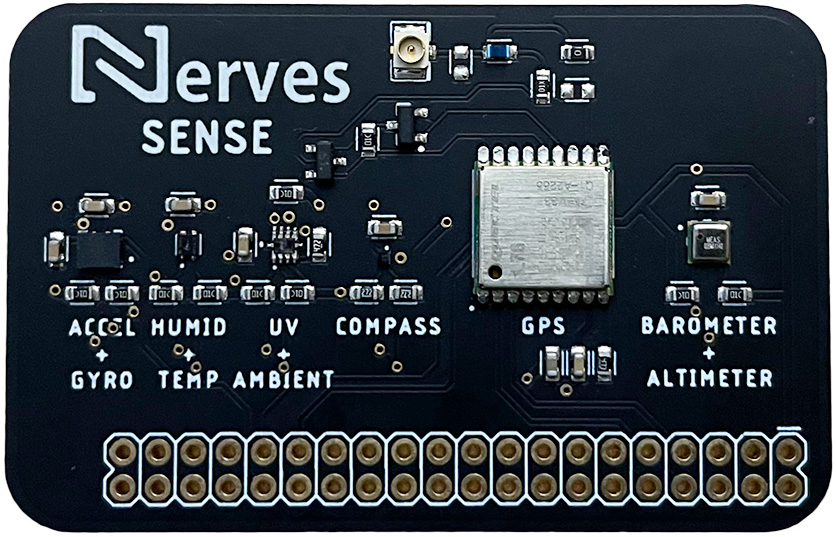

# Nerves Sense

A library for using the [Nerves Sense](https://github.com/jcrscott/Nerves-Sense) board with Elixir / Nerves.



## Installation

Add the `nerves_sense` dependency to your project's `mix.exs` file:

```ex
  defp deps do
    [
      {:nerves_sense, github: "amclain/nerves_sense"},
    ]
  end
```
